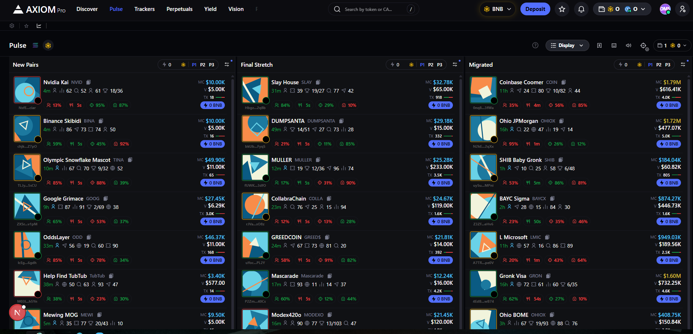
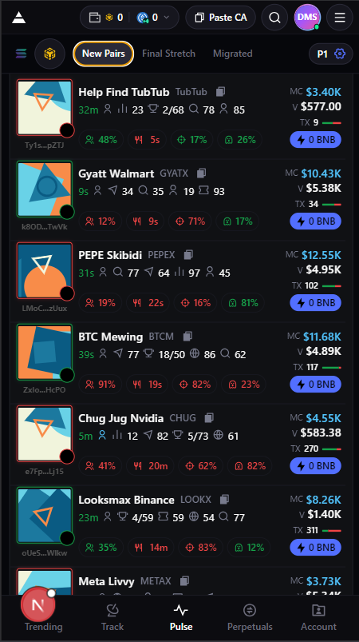

# Axiom Pulse – Token Trading Table (Frontend Assignment)

A pixel-perfect recreation of the **Axiom Pulse** token trading table UI with interactive behavior, real-time updates (mock WebSocket), and production-grade frontend structure.

This project is built as a performance-focused Next.js app with reusable UI primitives, feature-based architecture, and strong loading/error handling.

---

## Live Demo
- **Vercel Deployment:**

## Demo Video
- **YouTube (1–2 mins):** 

---

## Assignment Requirements Covered

✅ **All token columns**: New pairs, Final Stretch, Migrated  
✅ **Interaction variety**: tooltip, popover, modal, sorting  
✅ **Interaction patterns**: hover effects, click actions  
✅ **Real-time price updates** using mock WebSocket with smooth color transitions  
✅ **Loading states**: skeleton, shimmer, progressive loading + error boundaries  
✅ **Pixel-perfect UI** (target ≤ 2px difference)

---

## Tech Stack

- **Next.js 14** (App Router)
- **TypeScript** (strict)
- **Tailwind CSS**
- **Redux Toolkit** (app-level state)
- **React Query (@tanstack/react-query)** (data fetching & caching)
- **Radix UI / shadcn/ui** (accessibility-first interactive primitives)
- **Class Variance Authority (CVA)** for UI variants
- **ESLint** + clean component patterns

---

## Project Structure (Feature-Based + Atomic UI)
```
Axiom-pro/
├─ public/
│  ├─ screenshots/
│  │  ├─ pulse-desktop.png
│  │  ├─ pulse-mobile.png
│  │  ├─ interactions.png
│  │  └─ skeleton.png
│  └─ favicon.ico
│
├─ src/
│  ├─ app/
│  │  ├─ layout.tsx
│  │  ├─ globals.css
│  │  ├─ page.tsx
│  │  └─ pulse/
│  │     ├─ page.tsx
│  │     ├─ loading.tsx
│  │     └─ error.tsx
│  │
│  ├─ components/
│  │  ├─ atoms/
│  │  │  ├─ AxiomLogo.tsx
│  │  │  ├─ Badge.tsx
│  │  │  ├─ IconButton.tsx
│  │  │  ├─ NavButton.tsx
│  │  │  └─ Tooltip.tsx
│  │  │
│  │  ├─ molecules/
│  │  │  ├─ SearchInput.tsx
│  │  │  ├─ SortButton.tsx
│  │  │  └─ TokenRowActionsPopover.tsx
│  │  │
│  │  ├─ organisms/
│  │  │  ├─ HeaderBar.tsx
│  │  │  ├─ Sidebar.tsx
│  │  │  ├─ BottomStatusBar.tsx
│  │  │  └─ TokenTradingTable.tsx
│  │  │
│  │  └─ providers/
│  │     ├─ AppProviders.tsx
│  │     ├─ QueryProvider.tsx
│  │     └─ ReduxProvider.tsx
│  │
│  ├─ features/
│  │  └─ pulse/
│  │     ├─ api/
│  │     │  ├─ pulse.types.ts
│  │     │  ├─ pulse.mock.ts
│  │     │  └─ pulse.queries.ts
│  │     │
│  │     ├─ state/
│  │     │  ├─ pulse.slice.ts
│  │     │  └─ pulse.selectors.ts
│  │     │
│  │     ├─ ws/
│  │     │  └─ mockPriceSocket.ts
│  │     │
│  │     ├─ utils/
│  │     │  ├─ sort.ts
│  │     │  ├─ format.ts
│  │     │  └─ constants.ts
│  │     │
│  │     ├─ ui/
│  │     │  ├─ PulseScreen.tsx
│  │     │  ├─ PulseTabs.tsx
│  │     │  ├─ TokenTable.tsx
│  │     │  ├─ TokenRow.tsx
│  │     │  ├─ TokenDetailsModal.tsx
│  │     │  ├─ TokenTableSkeleton.tsx
│  │     │  └─ ErrorState.tsx
│  │     │
│  │     └─ index.ts
│  │
│  ├─ lib/
│  │  ├─ utils.ts
│  │  ├─ env.ts
│  │  └─ queryClient.ts
│  │
│  ├─ store/
│  │  ├─ index.ts
│  │  ├─ rootReducer.ts
│  │  └─ hooks.ts
│  │
│  ├─ hooks/
│  │  ├─ useDebounce.ts
│  │  └─ useMounted.ts
│  │
│  └─ types/
│     └─ global.d.ts
│
├─ .env.example
├─ .eslintrc.json
├─ .prettierrc
├─ next.config.js
├─ tailwind.config.ts
├─ tsconfig.json
├─ package.json
└─ README.md
```

### Architecture Notes
- **UI components** follow an *Atomic Design approach* (`atoms → molecules → organisms`).
- **Pulse feature module** contains:
  - data layer (React Query)
  - real-time update logic (mock websocket)
  - pulse-specific state (Redux slice)
  - UI composed from reusable primitives

---

## Core Functionality

### 1) Token Columns (Tabs)
The Pulse screen supports 3 datasets displayed via tabs:
- **New pairs**
- **Final Stretch**
- **Migrated**

### 2) Sorting
Table supports sorting on token metrics (example):
- Price
- Volume
- Liquidity
- Market cap
- Change %

Sorting is responsive and optimized to keep interaction under 100ms.

### 3) Interaction Variety
This project includes:
- **Tooltip** for metadata and details
- **Popover** for row actions (copy address, open chart/explorer, etc.)
- **Modal** for token details
- Hover row effects
- Click actions on token items

### 4) Real-Time Updates (Mock WebSocket)
A mock socket pushes price updates at intervals.
- Price changes are reflected instantly
- Smooth color transitions show direction:
  - green for increase
  - red for decrease

### 5) Loading + Error Handling
Includes production-ready UI states:
- Skeleton loading
- Shimmer effect
- Progressive loading pattern
- Error boundaries for crash safety
- Retry-friendly error UI

---

## Performance & Optimization

This implementation focuses on:
- minimal re-renders of rows/cells
- memoized components (`React.memo`)
- derived state via selectors
- stable query caching via React Query
- fast interactions and layout stability (no CLS)

Target: **Lighthouse score ≥ 90** on both mobile & desktop.

---

## Screenshots


### Pulse Page – Desktop


### Pulse Page – Mobile (320px)



---

## How to Run Locally

### 1) Install dependencies
```bash
npm install

